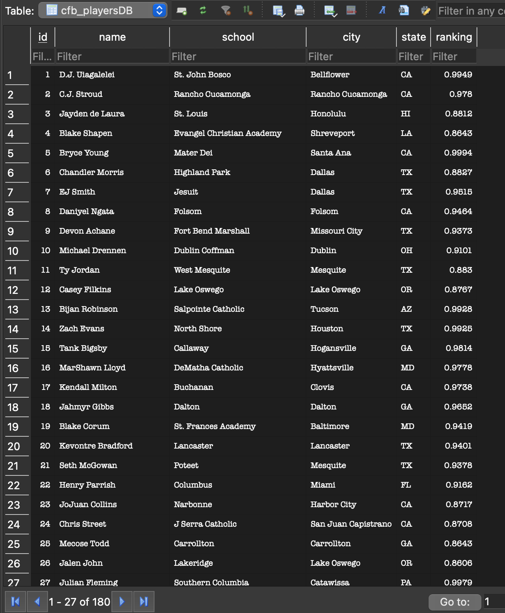

## Python Script interacting with SQL Database

### Project Data Source:
Repository forked from the https://github.com/nogibjj/sqlite-lab 
https://raw.githubusercontent.com/acgowda/cfb-recruit-net/525eea9f7a803080e57cee3e8b0cc0dd319ce0d3/data/2020/usc_offers.csv

### Project components

* ETL-Query:  [E] Extract a dataset from URL, [T] Transform, [L] Load into SQLite Database.
* [E] Extract a dataset from a URL like Kaggle or data.gov. JSON or CSV formats tend to work well.
* [T] Transform the data by cleaning, filtering, enriching, etc to get it ready for analysis.
* [L] Load the transformed data into a SQLite database table using Python's sqlite3 module.
* CRUD operations
* main.py -  for executing the functions that we created
* test_main.py - for testing the functions
* requirements file 

### Data Extraction

Above is the table format and data in it. 

### Heading here

### Heading here

### CRUD Operations
read , update, delete from the created table

### Test all the steps
