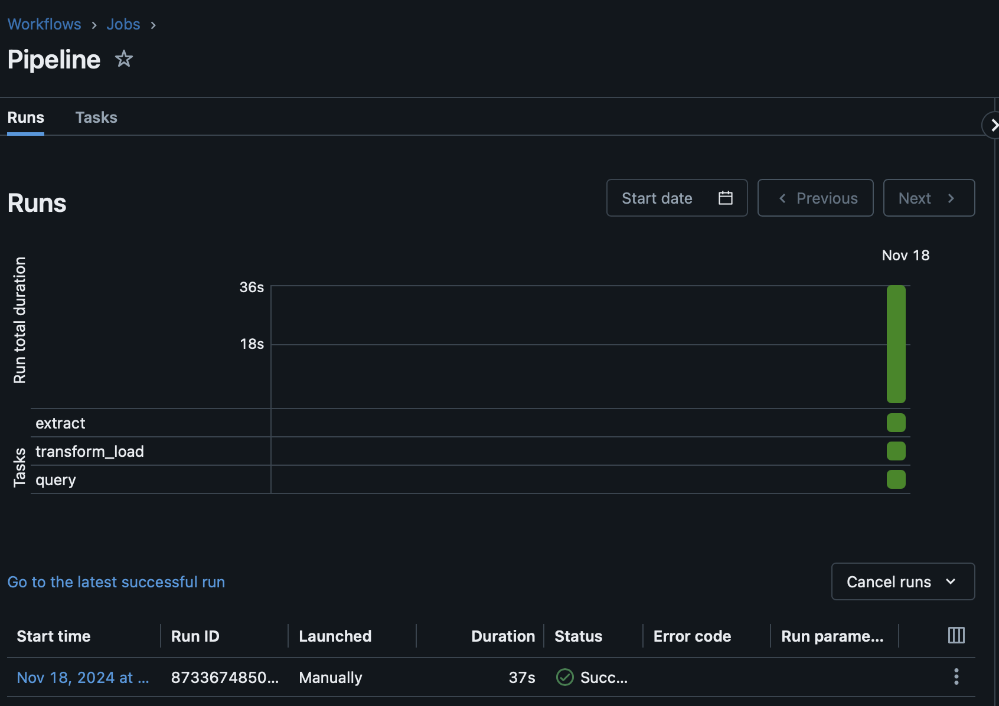

##  Data Pipeline using Databricks

## Key Features

1. **Data Extraction**
   - Utilizes the `requests` library to fetch datasets from specified URLs.
   - Stores the extracted data in the Databricks FileStore for further processing.

2. **Databricks Environment Setup**
   - Establishes a connection to the Databricks environment using environment variables for authentication (`SERVER_HOSTNAME` and `ACCESS_TOKEN`).
   - Configures Databricks clusters to support PySpark workflows.

3. **Data Transformation and Load**
   - Converts CSV files into Spark DataFrames for processing.
   - Transforms and stores the processed data as Delta Lake Tables in the Databricks environment.

4. **Query Transformation and Visualization**
   - Performs predefined Spark SQL queries to transform the data.
   - Creates visualizations from the transformed Spark DataFrames to analyze various metrics.

5. **File Path Validation**
   - Implements a function to check if specified file paths exist in the Databricks FileStore.
   - Verifies connectivity with the Databricks API for automated workflows.

6. **Automated Job Trigger via GitHub Push**
   - Configures a GitHub workflow to trigger a job run in the Databricks workspace whenever new commits are pushed to the repository.
   
## Project Components

### Environment Setup
- Create a Databricks workspace on Azure.
- Connect your GitHub account to the Databricks workspace.
- Set up a global init script for cluster start to store environment variables.
- Create a Databricks cluster that supports PySpark operations.
### Job Run results:

### Successful job runs

## Preparation Steps

1. Set up a Databricks workspace and cluster on Azure.
2. Clone this repository into your Databricks workspace.
3. Configure environment variables (`SERVER_HOSTNAME` and `ACCESS_TOKEN`) for API access.
4. Create a Databricks job to build and run the pipeline:
   - **Extract Task:** `mylib/extract.py`
   - **Transform and Load Task:** `mylib/transform_load.py`
   - **Query and Visualization Task:** `mylib/query.py`

## Project Components

### Environment Setup
- Create a Databricks workspace on Azure.
- Connect your GitHub account to the Databricks workspace.
- Set up a global init script for cluster start to store environment variables.
- Create a Databricks cluster that supports PySpark operations.

